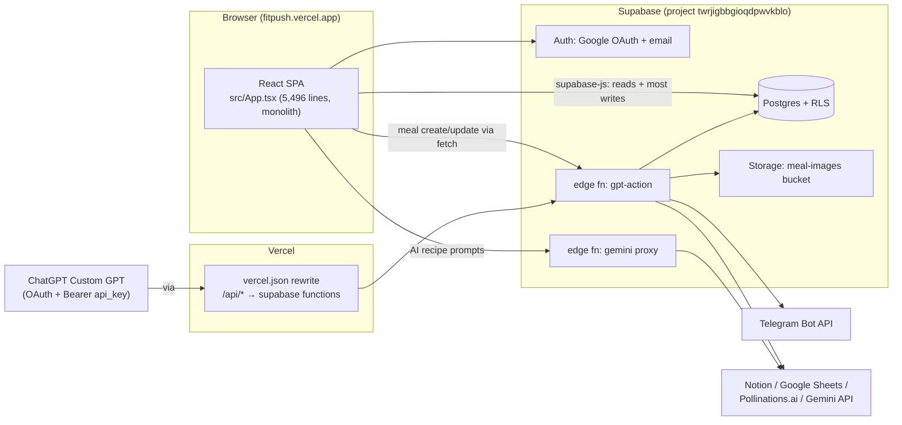

# Architecture

_Last verified: 2026-07-16 (full audit + same-day repair pass)._

## System map

## Key facts

- **Frontend**: one SPA, no router library — hand-rolled path/state routing inside `App.tsx` (`currentPath` + `activeTab`). Views: home dashboard, insights, recipes (popup), profile/edit, settings, onboarding wizard, oauth-consent, reset-password, login, public share view.
- **Data access is split two ways**: most reads/deletes go straight from the browser to Postgres via `supabase-js`; meal create/update goes through the `gpt-action` edge function with the user's `api_key` as bearer. Same data, two auth models.
- **State**: ~everything in `useState` inside `App.tsx`; meals/wellness/weight also mirrored to `localStorage` (keys prefixed `fitai_`). Realtime Postgres subscriptions refetch whole tables on any change.
- **ChatGPT integration**: Custom GPT calls `https://fitpush.vercel.app/api/*` (Vercel rewrite → gpt-action). Auth = OAuth code flow that ultimately hands the GPT the user's permanent `profiles.api_key`. Specs live in `gpt/openapi.yaml` (canonical-ish) and `supabase/functions/gpt-action/openapi.yaml` (stale duplicate).
- **Telegram**: per-user bot token/chat id on `profiles`; a `/telegram/cron` endpoint (secret query param) sends reminders/daily reports.
- **Images**: meal photos generated via Gemini (`gemini-2.5-flash-image`) or Pollinations.ai, then a fire-and-forget worker in gpt-action downloads them into the `meal-images` storage bucket.
- **Entry point quirk**: `src/main.tsx` loads `TestCardRunner` instead of the app when `?test_card=` is in the URL — dev builds only as of 2026-07-16.
- **Gemini access**: app text generation goes exclusively through the `gemini` edge function (JWT-auth). Multimodal features (photo analysis, meal-image generation) run client-side using the user's own key from profile preferences (known-issues #31).
- **Constants**: product constants live in `src/constants/` (`app.ts` — GPT URL, water goal, bot handle, localStorage keys; `nutrition.ts` — canonical default tracked-nutrients list + normalize/derive helpers used by load, realtime, and onboarding paths).
- **Dead files**: `src/components/LandingPage.FC.tsx`, `src/components/MascotCoach.tsx`, empty `design.md`, and stale `supabase/functions/gpt-action/openapi.yaml` are unused — delete on sight (deletion was tool-blocked during the 2026-07-16 session).
